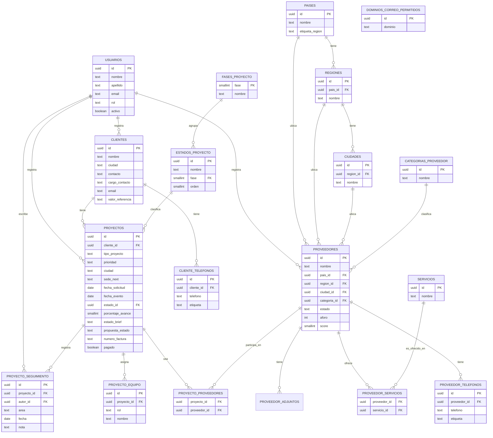

# Nexit · Fase 1: Análisis y planificación

**Proyecto:** Sistema de gestión de la información para la organización de proyectos de trabajo
**Nombre del sistema:** Nexus (nombre de trabajo, sujeto a cambio)
**Cliente/organización:** Next — agencia de marketing experiencial
**Fecha:** agosto de 2026
**Fase:** 1 de 4 (Análisis y planificación → Diseño de arquitectura → Construcción → Despliegue)

---

## 1. Objetivo del proyecto

Reemplazar el manejo actual de la información de Next —repartida entre un prototipo HTML/JS aislado, varios archivos de Excel de años distintos y procesos manuales de seguimiento por WhatsApp/correo— por un sistema web único donde el equipo (~20 personas) pueda registrar y consultar proveedores, clientes y proyectos, hacer seguimiento a cada proyecto desde la solicitud hasta la facturación, y generar informes periódicos automáticos.

Es un proyecto de presupuesto reducido (aprox. $500.000 COP en esta primera etapa), por lo que el alcance del MVP se mantiene deliberadamente acotado: se prioriza reemplazar lo que hoy se hace a mano en Excel, no construir todas las funciones que aparecen en los archivos históricos.

## 2. Fuentes de información analizadas

| Fuente | Qué es | Qué aportó al análisis |
|---|---|---|
| `baseproveedores_Next.html` | Prototipo funcional (front-end) construido por la persona que lidera el proyecto por el lado de Next. Login, gestión de proveedores y proyectos, filtros, informes. | Define la experiencia de usuario y los campos que la agencia ya espera ver en el sistema. |
| `nexus_schema.sql` | Propuesta de modelo de datos (PostgreSQL/Supabase) hecha junto con el prototipo. | Punto de partida del modelo de datos: 7 tablas (perfiles, proveedores, adjuntos, proyectos, equipo, relación proyecto-proveedor, snapshots de informes). |
| `BD_CLIENTES_Y_PROVEEDORES__NEXT_MX.xlsx` | Base de contactos real de la operación en México: hojas `BD_PROVEEDORES` (140 filas) y `BD_CLIENTES` (32 filas). | Reveló que **clientes** ya se maneja como una base de datos estructurada tan completa como la de proveedores, y trajo campos que el prototipo no tenía (teléfono secundario, cargo del contacto, sitio web, dirección, aforo, costo de referencia). |
| `Seguimiento de proyectos.xlsx` | Histórico de seguimiento operativo 2022–2026 (13 hojas: proyectos corporativos, eventos sociales, finalizados, no ejecutados, tráfico de proyectos, etapas de captación de clientes, etc.) | Reveló el proceso real de trabajo: prioridad, ciudad y sede del evento, fecha de solicitud, estado de la propuesta enviada al cliente, número de factura y estado de pago, y una bitácora de seguimiento por proyecto que hoy se escribe a mano en una sola celda de Excel. |

## 3. Hallazgos principales (prototipo vs. operación real)

El prototipo de tu amiga es un buen punto de partida —está bien pensado y ya cubre el flujo básico de proveedores y proyectos— pero se construyó sin ver el histórico de seguimiento. Al comparar los dos, aparecen tres brechas importantes:

**Clientes no es una entidad, es un campo de texto.** En `nexus_schema.sql`, `proyectos.cliente` es texto libre. Pero `BD_CLIENTES` muestra que la agencia ya lleva una base de clientes con la misma riqueza de datos que la de proveedores (contacto, cargo, teléfono, correo, ciudad). Dejarlo como texto libre significa perder esa información al migrar y volver a tener el problema de "SURA" vs. "Sura S.A." como registros distintos.

**Falta todo el seguimiento operativo del día a día.** El prototipo modela bien el *qué* (estado del proyecto, estado del brief), pero el Excel de seguimiento muestra que la operación real necesita también el *cómo va*: prioridad del proyecto, ciudad y sede de Next a cargo, fecha en que llegó la solicitud (distinta de la fecha del evento), y el estado de la propuesta que se le envía al cliente, que hoy se marca a mano como "ENVIADA" / "N/A" / etc. Tampoco existe ningún campo de facturación (número de factura, si ya se pagó).

**La bitácora de avance es una sola celda de texto que crece indefinidamente.** La columna "SEGUIMIENTO (incluir fecha de actualización)" del Excel es, en la práctica, un historial de notas fechadas escritas por distintas personas dentro de una sola celda (ej. *"29 jun - Confirmación de proveedores... / 24 Junio - Se solicita..."*). Esto es difícil de leer, no se puede ordenar ni filtrar, y se pierde quién escribió cada nota. Conviene modelarlo como una tabla de notas con fecha y autor.

Adicionalmente, el Excel de seguimiento contiene una hoja **"Etapas clientes"** que documenta el embudo comercial de captación de clientes (5 etapas, desde el contacto inicial hasta el cierre, con responsable y % de avance de cada etapa). Es información valiosa, pero es un proceso *comercial* distinto del seguimiento *operativo* de un proyecto ya ganado — se deja fuera de este MVP (ver sección 6).

### 3.1 Segunda revisión — verificación de completitud de campos

Después de la primera versión de este documento se hizo una segunda pasada, releyendo las 13 hojas del Excel de seguimiento completas (no solo una muestra) y revisando el código fuente del prototipo HTML en busca de campos que no aparecieran en el formulario visible. El prototipo no escondía nada nuevo: los datos de ejemplo dentro de su JavaScript usan exactamente los mismos campos que ya estaban documentados. El Excel sí reveló información adicional:

| Hallazgo | Detalle | Dónde quedó |
|---|---|---|
| Porcentaje de avance | Casi todas las hojas (2023–2026) traen una columna `PORCENTAJE PROCESO` / `PORC PROC` con un número manual de avance (10%, 30%, 70%...), independiente del estado. No estaba en el modelo. | `proyectos.porcentaje_avance` (nuevo) |
| Notas por área | Las columnas "RESPONSABILIDADES - CREATIVO / COMERCIAL / ADMINISTRATIVO" no son asignación de personas (eso ya lo cubre `proyecto_equipo`): son comentarios de estado pendiente por departamento, ej. *"pendiente por entrega de reel"*, *"pendiente por pago"*. | `proyecto_seguimiento.area` (nuevo, etiqueta cada nota) |
| Segunda bitácora | Las hojas más antiguas tienen "OBSERVACIONES ADICIONALES" como columna de notas fechadas, separada de "SEGUIMIENTO". Ambas son historial de avance del mismo tipo. | Se unifican en `proyecto_seguimiento` (una nota más, sin importar de cuál columna vino) |
| Valor de referencia del cliente | `BD_CLIENTES` trae una columna `COSTO`, igual que `BD_PROVEEDORES`. | `clientes.valor_referencia` (nuevo, confirmado contigo) |

Dos cosas se revisaron y se dejaron como estaban, con su justificación:

- **La columna `ETAPA`** del Excel (valores inconsistentes entre años: "ETAPA 1" a "ETAPA 6", "Cierre - Facturado", "No ejecutado") no se modela aparte. Se asume que `proyecto_estado` es el reemplazo limpio que Luisa ya diseñó a propósito para el sistema nuevo — vale la pena confirmarlo con ella antes de migrar el histórico, pero no es un campo que falte.
- **El ID numérico por proyecto** de cada hoja del Excel (001, 002...) no se conserva como campo de trazabilidad — se decidió que no hace falta mantener ese rastro una vez migrados los datos.

También se encontraron errores de captura en los archivos de origen que no son campos faltantes sino **datos sucios a limpiar en la migración**: un valor de teléfono/texto mezclado en la columna `AFORO` de `BD_CLIENTES`, y el valor `"BAJA"` (que es una prioridad, no una ciudad) metido en la columna `CIUDAD PROYECTO` de la hoja `NO EJECUTADOS 2026`.

### 3.2 Tercera revisión — verificación exhaustiva, columna por columna

Se pidió confirmar con más rigor que no faltaran campos. Se hizo una verificación más agresiva: comparar cada encabezado de las 13 hojas contra el modelo uno por uno, revisar si había columnas con datos pero sin encabezado (columnas "fantasma" que suelen aparecer por copiar y pegar entre hojas), correr una búsqueda de palabras clave financieras y contractuales (valor, monto, contrato, anticipo, IVA, comisión, orden de compra, etc.) en las 13 hojas, y revisar de nuevo los objetos de ejemplo dentro del JavaScript del prototipo y las funciones que arman el informe, en busca de algo que no estuviera expuesto en el formulario visible.

Resultado: no aparecieron campos financieros/contractuales adicionales, ni datos ocultos en el prototipo, ni nada nuevo en el informe. Sí apareció un hallazgo real:

- **Falta el estado "No ejecutado" como desenlace de un proyecto.** El Excel tiene una hoja `NO EJECUTADOS` separada, todos los años (2023 a 2026), para proyectos que se cotizaron pero el cliente nunca confirmó. Es distinto de "Cancelado" (que implica que algo sí se había confirmado y se frenó a mitad de camino). Se agregó como un valor más de `proyecto_estado`.

Dos hallazgos adicionales que **no** son campos faltantes, pero vale la pena dejarlos anotados para la fase de migración:

- `BD_PROVEEDORES` no tiene ninguna columna de país (solo ciudad), mientras que en el schema `proveedores.pais` es obligatorio. Habrá que derivar el país a partir de la ciudad al migrar, o revisar si ese campo debe dejar de ser obligatorio.
- El campo `clientes.valor_referencia` que agregamos en la revisión anterior casi no se usa hoy: en `BD_CLIENTES` la columna `COSTO` está vacía en las 30 filas. Se deja el campo para uso futuro, no porque la operación actual lo esté llenando — quería que lo supieras para que no te sorprenda verlo vacío en casi todos los clientes.

### 3.3 Cuarta revisión — catálogos que estaban incrustados en el HTML

La usuaria señaló que el HTML sí trae información que faltaba: no como campos de formulario nuevos (esos ya se habían verificado a fondo, ver 3.2), sino como **listas fijas incrustadas en el JavaScript** que nunca se habían llevado a tablas propias:

- La jerarquía país → departamento/estado → ciudad (constante `GEO` del prototipo, usada para los selects en cascada del formulario de proveedor): 3 países, 115 departamentos/estados y 411 ciudades.
- La lista de 26 categorías de proveedor (`<select id="f_cat">`).
- Los 9 estados de proyecto, agrupados en 3 fases con nombre propio ("Fase 1 · Planeación interna", "Fase 2 · Con decisión del cliente", "Fase 3 · Cierre y facturación") — esto ya eran los mismos valores del ENUM `proyecto_estado`, pero la agrupación por fase solo existía como comentario en el código, no como dato consultable.

Hasta la tercera revisión, país/región/ciudad y categoría de proveedor quedaban como texto libre, y el estado de proyecto como un `ENUM` cerrado. Eso funcionaba, pero tenía dos problemas: un texto libre no impide errores de tipeo ni combinaciones imposibles (una "ciudad" que no corresponda a ningún departamento real), y un `ENUM` solo se puede ampliar cambiando el código, no agregando una fila.

Se resolvió creando 5 tablas de catálogo nuevas (`paises`, `regiones`, `ciudades`, `categorias_proveedor`, `estados_proyecto`) y hacer que `proveedores` y `proyectos` las referencien por llave foránea en vez de guardar texto libre o un `ENUM`. Al probarlo contra Postgres real apareció un hallazgo adicional: las 3 llaves foráneas de proveedor (país/región/ciudad) por sí solas no garantizaban que la combinación fuera *coherente* entre sí (se podía guardar país="México" con región="Antioquia", que es de Colombia); se agregó un trigger de validación que lo impide. El detalle completo está en la sección 5.3.

## 4. Decisiones tomadas para esta fase

Con base en lo anterior, se definieron tres decisiones de alcance:

1. **Clientes será una entidad propia** en el modelo de datos, con la misma estructura que proveedores (nombre, contacto, cargo, teléfono(s), correo, ciudad, dirección, web, notas), relacionada a Proyectos por `cliente_id` en vez de texto libre.
2. **El MVP incluye seguimiento operativo básico**: prioridad, ciudad/sede, fecha de solicitud, estado de la propuesta, número de factura y si está pagado. También se agrega la bitácora de seguimiento como tabla propia.
3. **El backend se construye en C#/.NET (ASP.NET Core Web API)**, exponiendo una API REST consumida por el frontend (desplegado en Vercel) y conectada a PostgreSQL en Supabase. Supabase Auth se reutiliza para el login (evita construir autenticación desde cero).

Queda **fuera de alcance de este MVP** (propuesto para una fase futura, ver sección 6): el embudo comercial de captación de clientes y la migración de los datos históricos 2022–2026 hacia la base nueva.

## 5. Modelo de datos propuesto

### 5.1 Entidades

| Entidad | Descripción | Estado frente al prototipo |
|---|---|---|
| `usuarios` | Usuarios internos del sistema (~20 personas), vinculados a `auth.users` de Supabase. | Ampliada (octava revisión): nombre/apellido separados, `rol` pasa a `ENUM`, se agrega `activo` y `updated_at`. |
| `dominios_correo_permitidos` | Catálogo de dominios de correo laboral autorizados para crear una cuenta (ej. `nextexperiencial.com`). | **Nueva** (octava revisión). |
| `paises` | Catálogo de países. | **Nueva** (cuarta revisión) — antes era la constante `GEO` del HTML. |
| `regiones` | Catálogo de departamentos/estados, cada uno de un país. | **Nueva.** |
| `ciudades` | Catálogo de ciudades, cada una de un departamento/estado. | **Nueva.** |
| `categorias_proveedor` | Catálogo de categorías de proveedor (26 valores: Catering, Hotel, Rooftop, etc.). | **Nueva** — antes era una lista fija dentro del `<select>` del HTML. |
| `fases_proyecto` | Catálogo de las 3 fases de un proyecto (Planeación interna / Con decisión del cliente / Cierre y facturación). | **Nueva** (quinta revisión) — separada de `estados_proyecto` para eliminar una dependencia transitiva (3FN). |
| `estados_proyecto` | Catálogo de los 9 estados posibles de un proyecto, cada uno con su fase. | **Nueva** — reemplaza el `ENUM proyecto_estado`. |
| `clientes` | Empresas/clientes de Next, con su contacto principal. | **Nueva.** |
| `cliente_telefonos` | Teléfonos de un cliente (1 o más filas). | **Nueva** (quinta revisión) — antes `telefono`/`telefono2` en `clientes` (violaba 1FN). |
| `proveedores` | Proveedores de servicios para eventos (venues, catering, edecanes, etc.). | Ampliada: país/región/ciudad/categoría pasan de texto libre a llaves foráneas a los catálogos; se agregan cargo del contacto, web, dirección, aforo y costo de referencia, tomados de `BD_PROVEEDORES`. |
| `proveedor_telefonos` | Teléfonos de un proveedor (1 o más filas). | **Nueva** (quinta revisión) — antes `telefono`/`telefono2` en `proveedores` (violaba 1FN). |
| `servicios` | Catálogo abierto de servicios que puede ofrecer un proveedor. | **Nueva** (quinta revisión) — antes texto separado por comas en `proveedores.servicios` (violaba 1FN). |
| `proveedor_servicios` | Relación muchos-a-muchos entre proveedores y servicios. | **Nueva** (quinta revisión). |
| `proveedor_adjuntos` | Links o archivos asociados a un proveedor (portafolios, cotizaciones). | Sin cambios. |
| `proyectos` | Cada proyecto/evento gestionado para un cliente. | Ampliada: `cliente_id` reemplaza el texto libre; `estado_id` reemplaza el `ENUM`; se agregan tipo, prioridad, ciudad, sede, fecha de solicitud, % de avance, estado de la propuesta y datos de facturación. |
| `proyecto_equipo` | Personas de Next asignadas a un proyecto, con su rol. | Ampliada: el rol ahora incluye también Comercial y Administrativo (antes solo Ejecutivo y Diseñador). |
| `proyecto_proveedores` | Relación muchos-a-muchos entre proyectos y proveedores asignados. | Sin cambios. |
| `proyecto_seguimiento` | Bitácora de avance del proyecto: una fila por nota, con fecha, autor y área (general/creativo/comercial/administrativo). | **Nueva.** |
| `informes_snapshot` | Fotos periódicas (semanal/mensual) de los indicadores clave, para no tener que recalcular históricos. | Ampliada: incluye total de clientes. |

### 5.2 Diagrama entidad-relación

> **Aclaración: `usuarios` no es lo mismo que `clientes`, `proveedores` ni `proyectos`, y las líneas que los conectan en el diagrama no dicen lo contrario.**
>
> `usuarios` son las personas de Next (marketing, comercial, administrativo) que **inician sesión** en el sistema. `clientes` y `proveedores` son empresas externas que **nunca inician sesión** — no tienen fila en `auth.users`, no tienen contraseña, no pasan por el dominio de correo permitido ni por nada de lo que se armó en la sección de usuarios. Son dos tipos de cosa completamente distintos: uno es un **actor** (quien usa el sistema), el otro es una **entidad de negocio** (sobre la que el actor trabaja). En herramientas como Salesforce esta misma distinción existe con otro nombre: *User* (usuario interno, con licencia y login) vs. *Contact/Account* (un contacto o empresa externa, sin acceso al sistema salvo que se le dé explícitamente un portal aparte).
>
> Entonces, ¿qué son esas 4 líneas (`USUARIOS ||--o{ CLIENTES`, `PROVEEDORES`, `PROYECTOS`, `PROYECTO_SEGUIMIENTO`, todas con la palabra `registra`/`escribe`)? Son **campos de auditoría** (`created_by`, `autor_id`): cada cliente, proveedor, proyecto y nota de seguimiento guarda *quién de Next lo creó o lo escribió*, para poder responder "¿quién registró este cliente?" o "¿quién escribió esta nota?". Es el mismo patrón que usa cualquier sistema (CRM, ERP, lo que sea): una columna que apunta al usuario que hizo la acción, no una relación de identidad. `clientes.created_by` significa "el usuario que registró este cliente en el sistema", nunca "este cliente es un usuario".

El script SQL completo, ya probado contra una base PostgreSQL real, está en [`nexus_schema_v2.sql`](./nexus_schema_v2.sql). Cada cambio frente al schema original está marcado con `NUEVO` o `AMPLIADO` en los comentarios, para que sea fácil ver qué cambió y por qué.

### 5.3 Catálogos: por qué tabla y no texto libre / ENUM

País/región/ciudad y categoría de proveedor, y el estado de proyecto (con su fase), dejaron de ser texto libre o un `ENUM` cerrado y pasaron a ser tablas de catálogo (`paises`, `regiones`, `ciudades`, `categorias_proveedor`, `fases_proyecto`, `estados_proyecto`) referenciadas por llave foránea. Motivo: en el HTML esas listas estaban incrustadas directamente en el JavaScript — no se podían consultar ni ampliar sin modificar el código — y un `ENUM` de Postgres tiene el mismo problema (agregar un valor nuevo requiere una migración). Con una tabla, agregar un país, una ciudad o una categoría nueva (por ejemplo cuando alguien usa la opción "Otro" del formulario) es insertar una fila, no cambiar el schema. `servicios`, `cliente_telefonos` y `proveedor_telefonos` se agregaron en la ronda de normalización siguiente (sección 9) — el detalle de por qué está ahí.

Los datos de estas 5 tablas —3 países, 115 departamentos/estados, 411 ciudades, 26 categorías y 9 estados de proyecto— se extrajeron 1 a 1 de las listas del HTML y quedan en [`seed_geografia_categorias_estados.sql`](./schema/seed_geografia_categorias_estados.sql), para correr **después** de `nexus_schema_v2.sql`.

Al probar esto contra una base Postgres real apareció un detalle importante: tener `pais_id`, `region_id` y `ciudad_id` como 3 llaves foráneas independientes en `proveedores` no impedía guardar una combinación incoherente (por ejemplo país = México con región = Antioquia, que es de Colombia) — cada FK por separado era válida, pero la combinación no. Se agregó un trigger (`check_proveedor_geografia`) que valida la cadena completa antes de guardar o actualizar un proveedor, y se probó tanto el caso que debe fallar como el que debe pasar.

Los demás catálogos del sistema (estado de proveedor, presupuesto, cobertura, estado de brief, rol de equipo, tipo de proyecto, prioridad, estado de propuesta, área de la bitácora) se dejan como `ENUM`, porque no tienen jerarquía entre sí y la lista de valores posibles no necesita crecer con el uso — a diferencia de países, ciudades o categorías, donde sumar un valor nuevo es normal y esperado.

### 5.4 Modelo relacional (paso formal del MER a tablas)

El diagrama de 5.2 es el **modelo entidad-relación** (MER): entidades, atributos y relaciones, en forma gráfica. El **modelo relacional** es el paso siguiente en la metodología: convertir cada entidad y cada relación muchos-a-muchos en una **relación** (tabla) con sus atributos, marcando llave primaria (PK) y llaves foráneas (FK). Es exactamente lo que ya implementa `nexus_schema_v2.sql` en SQL — aquí queda además en la notación clásica `RELACION(atributo1, atributo2, ...)`, con la PK en **negrita** y las FK marcadas, para dejar registrado ese paso de forma explícita y no solo como código:

- **USUARIOS**(**id** FK→auth.users, nombre, apellido, email, rol, iniciales, activo, created_at, updated_at)
- **DOMINIOS_CORREO_PERMITIDOS**(**id**, dominio)
- **PAISES**(**id**, nombre, etiqueta_region)
- **REGIONES**(**id**, pais_id FK→PAISES, nombre)
- **CIUDADES**(**id**, region_id FK→REGIONES, nombre)
- **CATEGORIAS_PROVEEDOR**(**id**, nombre)
- **FASES_PROYECTO**(**fase**, nombre)
- **ESTADOS_PROYECTO**(**id**, nombre, fase FK→FASES_PROYECTO, orden)
- **CLIENTES**(**id**, nombre, sector, ciudad, direccion, web, contacto, cargo_contacto, email, valor_referencia, notas, created_by FK→USUARIOS, created_at, updated_at)
- **CLIENTE_TELEFONOS**(**id**, cliente_id FK→CLIENTES, telefono, etiqueta)
- **PROVEEDORES**(**id**, nombre, pais_id FK→PAISES, region_id FK→REGIONES, ciudad_id FK→CIUDADES, categoria_id FK→CATEGORIAS_PROVEEDOR, estado, contacto, cargo_contacto, email, web, direccion, aforo, costo_referencia, score, presupuesto, cobertura, notas, created_by FK→USUARIOS, created_at, updated_at)
- **PROVEEDOR_TELEFONOS**(**id**, proveedor_id FK→PROVEEDORES, telefono, etiqueta)
- **SERVICIOS**(**id**, nombre)
- **PROVEEDOR_SERVICIOS**(**proveedor_id** FK→PROVEEDORES, **servicio_id** FK→SERVICIOS) — PK compuesta
- **PROVEEDOR_ADJUNTOS**(**id**, proveedor_id FK→PROVEEDORES, tipo, nombre, url, storage_path, meta, fecha, created_at)
- **PROYECTOS**(**id**, nombre, cliente_id FK→CLIENTES, contacto_proyecto, tipo_proyecto, prioridad, ciudad, sede_next, fecha_solicitud, fecha_evento, estado_id FK→ESTADOS_PROYECTO, porcentaje_avance, estado_brief, propuesta_estado, numero_factura, pagado, fecha_pago, notas, created_by FK→USUARIOS, created_at, updated_at)
- **PROYECTO_EQUIPO**(**id**, proyecto_id FK→PROYECTOS, rol, nombre)
- **PROYECTO_PROVEEDORES**(**proyecto_id** FK→PROYECTOS, **proveedor_id** FK→PROVEEDORES) — PK compuesta
- **PROYECTO_SEGUIMIENTO**(**id**, proyecto_id FK→PROYECTOS, autor_id FK→USUARIOS, area, fecha, nota, created_at)
- **INFORMES_SNAPSHOT**(**id**, tipo, periodo_key, total_proveedores, total_clientes, total_proyectos, proyectos_sin_proveedor, por_estado, por_brief, created_by FK→USUARIOS, created_at)

20 relaciones, una por cada `CREATE TABLE` de `nexus_schema_v2.sql`. Las dos relaciones muchos-a-muchos (`PROVEEDOR_SERVICIOS`, `PROYECTO_PROVEEDORES`) tienen PK compuesta por las dos FK, sin atributos propios — es la forma estándar de resolver una relación N:M al pasar del MER al modelo relacional. `DOMINIOS_CORREO_PERMITIDOS` es la única relación sin FK entrante: `USUARIOS.email` se valida contra ella con un trigger (coincidencia de dominio), no con una llave foránea, porque el correo no "apunta" a una fila del catálogo sino que debe *terminar* en uno de sus valores — no es el mismo tipo de relación que país→región→ciudad. Sobre este modelo relacional (no sobre el diagrama gráfico) es que se aplican formalmente las 4 formas normales, en la sección 9.

## 6. Requisitos funcionales del MVP

**Gestión de clientes:** crear, editar, buscar y archivar clientes; ver el historial de proyectos de un cliente.

**Gestión de proveedores:** crear, editar, buscar y filtrar proveedores por país/región/ciudad/categoría/estado; adjuntar links o archivos de referencia; calificar con un score de 1 a 5.

**Gestión de proyectos:** crear un proyecto asociado a un cliente; registrar tipo, prioridad, ciudad, sede, fecha de solicitud y fecha del evento; mover el proyecto por sus estados (planeación → confirmado → en curso → finalizado/cancelado → facturado); asignar equipo interno por rol; asociar uno o varios proveedores; marcar el estado de la propuesta enviada al cliente; registrar número de factura y si ya se pagó.

**Bitácora de seguimiento:** agregar notas fechadas a un proyecto, visibles en orden cronológico, cada una con su autor.

**Informes:** generar y guardar una foto (snapshot) semanal o mensual con totales de clientes, proveedores y proyectos, y el conteo por cada estado.

**Usuarios (ampliado, octava revisión):** crear cuenta con nombre, apellido y correo laboral (solo se acepta un dominio de la lista de `dominios_correo_permitidos`, ej. `nextexperiencial.com`); verificación del correo al primer inicio de sesión usando el flujo nativo de Supabase Auth (token + expiración + envío del correo, sin construir nada propio); contraseña administrada por Supabase Auth (nunca se guarda en la base de datos propia); cada usuario tiene un rol (`admin`, `manager`, `miembro`) que determina qué puede hacer — el detalle fino de permisos por rol se define en la fase de diseño; un usuario se puede marcar `activo`/inactivo para darlo de baja sin borrar su historial (proyectos que creó, notas que escribió, etc. quedan intactos).

## 7. Requisitos no funcionales

- **Backend:** ASP.NET Core Web API (C#/.NET), exponiendo endpoints REST. Se eligió sobre otras opciones por el manejo previo del equipo con el ecosistema .NET y porque encaja bien como servicio independiente desplegado aparte del frontend.
- **Base de datos:** PostgreSQL administrado por Supabase. Se aprovechan Row Level Security y Supabase Auth (evita construir login/registro/recuperación de contraseña desde cero).
- **Frontend:** desplegado en Vercel (framework a definir en la fase de diseño).
- **Backend — despliegue:** por definir en la fase de diseño de arquitectura (candidatos típicos para una API .NET con presupuesto ajustado: Railway, Render, Azure App Service en el tier gratuito/económico, o un contenedor en Fly.io).
- **Usuarios concurrentes:** bajo (~20 personas de la agencia), no se anticipan requisitos de escalabilidad exigentes en el MVP.
- **Idioma:** todo el sistema (interfaz, datos, documentación) en español, siguiendo la convención ya usada en el prototipo y el schema original.

## 8. Fuera de alcance del MVP (propuesto para una fase futura)

- **Embudo comercial de captación de clientes** (hoja "Etapas clientes" del Excel: 5 etapas desde contacto inicial hasta cierre). Es un proceso distinto al seguimiento de un proyecto ya ganado, y agregarlo ahora ampliaría bastante el alcance para el presupuesto disponible.
- **Migración de datos históricos** (2022–2026, ~13 hojas de Excel con miles de filas). Se recomienda definir por separado un script de migración/limpieza de datos una vez el modelo esté aprobado y en producción, en vez de incluirlo en el desarrollo inicial.
- **Facturación completa** (hoy solo se contempla número de factura y si está pagado; conceptos como montos, anticipos o notas crédito quedan para una fase posterior si se necesitan).
- **Múltiples contactos por cliente/proveedor** (por ahora, un contacto principal por registro, igual que en el prototipo).

## 9. Normalización: aplicación de las 4 formas normales

Hasta ahora el trabajo fue de modelo entidad-relación: identificar entidades, atributos y relaciones. Esta sección aplica formalmente las 4 formas normales (1FN a 4FN) sobre ese modelo para eliminar redundancia y los problemas que trae (datos que se desactualizan en un lugar y no en otro, filas que no se pueden borrar sin perder información de otra entidad, etc.), que es justamente lo que hace que una base de datos sea eficiente y confiable a largo plazo.

### 9.1 Qué es cada forma normal

**Primera forma normal (1FN):** cada columna debe guardar un solo valor indivisible (atómico), no una lista ni varios datos combinados en una celda; y no debe haber "grupos repetitivos" — es decir, la misma clase de dato repetida en varias columnas (como `telefono`, `telefono2`, `telefono3`) en vez de en varias filas de otra tabla.

**Segunda forma normal (2FN):** la tabla debe cumplir 1FN, y además todo atributo que no sea parte de la clave debe depender de la **clave completa**, no solo de una parte de ella. Esto solo es relevante en tablas con clave primaria compuesta (de 2 o más columnas); si la clave es un solo campo, la tabla cumple 2FN automáticamente en cuanto cumple 1FN.

**Tercera forma normal (3FN):** la tabla debe cumplir 2FN, y ningún atributo que no sea clave puede depender de **otro atributo que tampoco sea clave** — solo puede depender de la clave primaria. Cuando eso pasa se llama "dependencia transitiva": un dato que en realidad describe a otro dato, no a la fila completa.

**Cuarta forma normal (4FN):** la tabla debe cumplir 3FN (o su versión más estricta, BCNF), y no puede mezclar **dos o más hechos multivaluados independientes** de la misma entidad en una sola tabla — cada uno debe tener su propia tabla intermedia, para no generar combinaciones falsas entre ellos.

### 9.2 Qué se encontró y qué se corrigió

Revisando las 19 tablas del modelo contra estas 4 reglas aparecieron 3 violaciones reales, todas corregidas ya en `nexus_schema_v2.sql`:

**1FN — `proveedores.servicios` guardaba una lista en un solo campo.** El prototipo guardaba los servicios de un proveedor como texto separado por comas (ej. `"video mapping, pantallas LED"`), que es exactamente lo que 1FN prohíbe: una celda con más de un valor. Se separó en un catálogo `servicios` (igual de abierto que categorías: si alguien escribe un servicio nuevo, se agrega como fila) y una tabla intermedia `proveedor_servicios`, siguiendo el mismo patrón que ya existía para proveedores y proyectos.

**1FN — `telefono` / `telefono2` en clientes y proveedores.** Tener dos columnas para el mismo tipo de dato es un "grupo repetitivo" — el caso clásico que 1FN no permite. Si mañana alguien necesita guardar un tercer teléfono, tocaría agregar `telefono3` y cambiar el schema otra vez. Se separaron en `cliente_telefonos` y `proveedor_telefonos`, donde cada teléfono es una fila (con una etiqueta como "Principal" o "WhatsApp") — se puede guardar 1, 2 o 10 teléfonos sin tocar la estructura.

**3FN — `estados_proyecto.fase_nombre` dependía de `fase`, no del estado.** Cada estado tenía guardado el nombre completo de su fase (ej. todos los estados con `fase = 2` repetían el texto `"Con decisión del cliente"`). Ese nombre no es un dato propio de cada estado — depende de la fase, que es otro atributo de la misma tabla que no es la clave. Es la definición exacta de una dependencia transitiva. Se separó en una tabla `fases_proyecto` (3 filas: una por fase) y `estados_proyecto` ahora solo guarda el número de fase como llave foránea; el nombre de la fase se obtiene con un `JOIN`.

**2FN — no se encontraron violaciones.** La única tabla del modelo con clave primaria compuesta es `proyecto_proveedores` (`proyecto_id`, `proveedor_id`), y no tiene ninguna otra columna que pudiera depender de solo una parte de esa clave. El resto de las 19 tablas usa una clave simple (`id uuid`), así que 2FN se cumple automáticamente en todo el modelo en cuanto se cumple 1FN.

**4FN — no se encontraron violaciones adicionales**, una vez resueltas las de 1FN. Cada hecho multivaluado de una entidad (los servicios de un proveedor, sus teléfonos, los proveedores de un proyecto, el equipo de un proyecto, las notas de seguimiento) ya vive en su propia tabla intermedia — nunca se mezclan dos hechos independientes en la misma tabla, que es justo lo que 4FN exige.

Una excepción a propósito, no una violación: `informes_snapshot.por_estado` y `por_brief` usan `jsonb` para guardar un resumen calculado (conteo por cada estado, en el momento de guardar el informe). Técnicamente un campo `jsonb` no es un valor atómico, pero aquí es intencional: es una foto congelada para reportes históricos, no un dato operativo que el sistema necesite filtrar o editar campo por campo — normalizarlo obligaría a recalcular el histórico cada vez que cambia un proyecto, que es exactamente lo que una tabla de snapshots busca evitar.

### 9.3 Resultado

El modelo pasó de 14 a 19 tablas. Las 5 nuevas son todas de descomposición (no agregan información nueva, reorganizan la que ya había): `fases_proyecto`, `servicios`, `proveedor_servicios`, `cliente_telefonos`, `proveedor_telefonos`. El script `nexus_schema_v2.sql` y el `seed_geografia_categorias_estados.sql` ya están actualizados y probados de nuevo contra una base PostgreSQL real, incluyendo insertar teléfonos y servicios por separado y confirmar que el nombre de cada fase se obtiene por `JOIN` en vez de estar repetido.

Sources: [Normalización de bases de datos — Wikipedia](https://es.wikipedia.org/wiki/Normalizaci%C3%B3n_de_bases_de_datos), [Bases de Datos — Universidad Veracruzana, Facultad de Estadística e Informática](https://www.uv.mx/personal/ermeneses/files/2020/09/Clase7-Normalizacion_parteIFinal.pdf)

### 9.4 Sexta revisión — `propuesta_estado`: una columna, no tres

Después de entregar la quinta revisión, se señaló que `proyectos` repetía la misma columna de estado de propuesta tres veces (`propuesta_creativa_estado`, `propuesta_grafica_estado`, `propuesta_economica_estado`), en vez de un solo campo `propuesta`. Se volvió a revisar el Excel completo, hoja por hoja, para confirmar el dato real:

- Las 3 columnas separadas (`PROPUESTA CREATIVA (RENDER)`, `PROPUESTA GRAFICA (GRAFICO PRESENTACIÓN)`, `PROPUESTA ECONÓMICA`) sí existen, pero solo en 2 hojas: `Trafico proyectos Next` y `PROYECTOS 2023`. Ambas son un formato de plantilla antiguo, ya reemplazado por las hojas que Next usa hoy (`SEG.PROYECTOS CORP 2023` a `2026`, `PROYECTOS FINALIZADOS`, `NO EJECUTADOS`, `EVENTOS SOCIALES`), ninguna de las cuales trae ese desglose por tipo de propuesta.
- Es decir: el desglose en 3 tipos no es parte del proceso que la agencia usa actualmente — se copió de una plantilla vieja al armar la primera versión del modelo.
- Aun si se estuviera usando, repetir la misma columna 3 veces solo porque cambia un calificador (creativa/gráfica/económica) es la misma violación de 1FN que ya se había corregido para `telefono`/`telefono2` en la quinta revisión (nota 13/14 del script): un "grupo repetitivo" representado como columnas en vez de filas.

Se corrigió dejando un solo campo `proyectos.propuesta_estado` (ENUM: `No enviada` / `En proceso` / `Enviada`). Si en el futuro la operación sí necesita trackear varios tipos de propuesta con estados independientes, el modelo correcto no sería agregar columnas sino una tabla relacionada (`tipos_propuesta` + `proyecto_propuestas`), siguiendo el mismo patrón usado para `servicios` y para los teléfonos. El cambio ya está aplicado y probado en `nexus_schema_v2.sql` (nota 14).

### 9.5 Séptima revisión — reverificación completa de 1FN a 4FN, tabla por tabla

Se pidió confirmar con más rigor que las 4 formas normales están bien aplicadas. Se repasaron las 19 tablas del modelo relacional (sección 5.4) una por una, no solo las que ya se habían tocado:

- **1FN:** ninguna columna guarda una lista ni varios valores en una celda, y no quedan grupos repetitivos (columnas del mismo tipo de dato repetidas, como `telefono`/`telefono2` o las 3 columnas de propuesta) en ninguna de las 19 tablas.
- **2FN:** las únicas tablas con llave primaria compuesta son `proveedor_servicios` (proveedor_id, servicio_id) y `proyecto_proveedores` (proyecto_id, proveedor_id). Ninguna de las dos tiene una sola columna adicional aparte de su propia clave — no hay nada que pueda depender de solo una parte de la clave. Las otras 17 tablas usan clave simple (`id`), así que cumplen 2FN en cuanto cumplen 1FN.
- **3FN:** se revisó cada columna no-clave de las 19 tablas buscando si dependía de otra columna no-clave en vez de depender de la clave primaria. No se encontró ninguna dependencia transitiva adicional a la ya corregida en la quinta revisión (`fase_nombre`). Por ejemplo, se verificó puntualmente que `estados_proyecto.orden` (1 a 9, el orden global de despliegue) no depende solo de `fase` — varios estados comparten `fase` pero tienen `orden` distinto — así que no es una dependencia transitiva, es un atributo propio de cada estado.
- **4FN:** se revisó que ningún hecho multivaluado independiente de una entidad comparta tabla con otro. Los 4 hechos multivaluados del modelo (teléfonos de cliente, teléfonos de proveedor, servicios de proveedor, proveedores de un proyecto) están cada uno en su propia tabla — ninguno se mezcla con otro.

**Conclusión: las 19 tablas cumplen 1FN, 2FN, 3FN y 4FN.** No apareció ninguna violación nueva de las 4 formas normales en esta pasada.

En el camino aparecieron 3 observaciones que **no son violaciones de forma normal** (no rompen ninguna de las 4 reglas), pero son decisiones de diseño relacionadas que vale la pena dejar explícitas, ya que se pidió máximo rigor:

1. **`proyecto_equipo.nombre` es texto libre, no una llave foránea a `usuarios`.** A diferencia de `proyecto_seguimiento.autor_id`, que sí referencia `usuarios(id)`, el responsable de un proyecto se guarda por nombre de texto. Esto es intencional por ahora: no todo "RESPONSABLE NEXT" del Excel tiene necesariamente una cuenta de usuario en el sistema (login de Supabase Auth) — si en Fase 2 se decide que todo el equipo va a tener cuenta, este campo se puede volver FK.
2. **`clientes.ciudad` y `proyectos.ciudad` siguen siendo texto libre**, sin conectarse al catálogo `ciudades` que sí usa `proveedores.ciudad_id`. No es una violación de forma normal (cada celda sigue guardando un solo valor), pero sí es una inconsistencia frente al resto del modelo, y abre la puerta al mismo problema de tipeo que se resolvió para proveedores (ej. "Bogotá" vs "BOGOTA" como registros distintos). Se deja así por ahora porque los proyectos y clientes de Next son mayoritariamente de Colombia (menos variedad real que las +400 ciudades de proveedores en México), pero es un candidato claro si más adelante se quiere el mismo nivel de control.
3. **`proveedor_adjuntos` tiene columnas cuyo significado cambia según `tipo`** (`url` aplica si `tipo = 'link'`, `storage_path` si `tipo = 'file'`). Cada columna sigue guardando un solo valor atómico (no rompe 1FN), pero es un patrón a vigilar: si en el futuro se agregan más tipos de adjunto con más campos propios, ahí sí valdría la pena separar en tablas por tipo.

Ninguna de las tres requiere cambio para Fase 1 — quedan anotadas para decidir en Fase 2 si conviene ajustarlas antes de implementar.

### 9.6 Octava revisión — usuarios del sistema

Se pidió completar el modelo de usuarios (`usuarios`): nombre y apellido, correo laboral restringido a un dominio, contraseña, verificación del correo al primer login con un token que expira, y estado activo/inactivo.

Antes de agregar nada había que resolver una pregunta de arquitectura: ¿qué de esto ya lo resuelve Supabase Auth (que administra `auth.users` por debajo de `usuarios`) y qué hay que construir? Se separó así:

- **Contraseña:** la administra Supabase Auth por completo (`auth.users.encrypted_password`, cifrada). `usuarios` nunca debe tener una columna de contraseña — guardarla dos veces sería además un riesgo de seguridad, no solo una redundancia.
- **Verificación de correo con token que expira:** Supabase Auth ya trae este flujo completo de fábrica (token, expiración, envío del correo). Se evaluó con la usuaria construir una tabla propia (`verificaciones_email`) para tener más control, y se decidió usar el flujo nativo de Supabase — para un presupuesto de ~$500.000 COP no se justifica reconstruir algo que ya viene incluido. Si más adelante se necesita más control (mensajes personalizados, reenvíos), ahí sí se agregaría una tabla propia.
- **Restricción de dominio de correo laboral:** esto **no** lo resuelve Supabase Auth solo — es una regla propia del negocio ("solo cuentas @nextexperiencial.com"). Se modela como catálogo, `dominios_correo_permitidos`, en vez de un valor fijo en el código, porque los datos de origen muestran que Next opera en más de un país (Colombia y México) y podría necesitar más de un dominio sin que eso implique tocar el schema. El dominio confirmado (`nextexperiencial.com`) sale del propio prototipo HTML: el campo de login tiene como placeholder `"nombre@nextexperiencial.com"`. En los Excel también aparece el dominio `nextcolombia.com` en un correo de contacto, pero no hay evidencia de que sea un dominio de *login* del sistema (podría ser solo un correo comercial de cara al cliente) — queda pendiente confirmarlo con Luisa/el equipo antes de agregarlo a la tabla.
- Se agregó un trigger (`check_usuario_dominio_correo`) que rechaza guardar un usuario cuyo correo no termine en un dominio de la tabla — como respaldo de base de datos. La validación principal (no dejar ni siquiera intentar el registro) debe vivir en la aplicación, antes de llamar a Supabase Auth, para no crear una cuenta huérfana en `auth.users` si el correo no es válido.
- **Nombre y apellido separados:** se reemplazó `nombre_completo` (un solo campo) por `nombre` + `apellido`, para poder ordenar/buscar por apellido y personalizar comunicaciones sin tener que separar texto después.
- **Activo/inactivo:** se agregó `usuarios.activo boolean DEFAULT true`, para dar de baja a alguien sin borrar su historial — los proyectos que creó, las notas de seguimiento que escribió, etc. siguen intactos y con su autor.
- **Rol:** de paso se corrigió `rol`, que era texto libre con los valores válidos escritos solo en un comentario (nada en la base de datos lo obligaba) — ahora es el `ENUM rol_usuario` (`admin` / `manager` / `miembro`), igual que el resto de catálogos cerrados del sistema. *(Nota de la auditoría del 2026-08-17: este documento originalmente decía `compras` en vez de `manager`. La usuaria confirmó que `manager` es el nombre correcto — lo cambió intencionalmente durante la construcción del backend — así que se corrigió aquí para que la documentación y el código coincidan.)*
- Por seguridad, `usuarios` no tiene política de RLS de escritura para usuarios autenticados: crear o editar un usuario (incluido el rol y el estado activo) se hace desde el backend con permisos de servicio, no directo desde la app — así nadie puede auto-asignarse el rol `admin` ni reactivarse a sí mismo.

El modelo pasó de 19 a **20 tablas** (se agregó `dominios_correo_permitidos`; `usuarios` se amplió pero sigue siendo la misma tabla). Se probó de nuevo contra Postgres real: un usuario con correo del dominio permitido se crea correctamente con sus valores por defecto (`rol = 'miembro'`, `activo = true`); un correo de un dominio no autorizado (`gmail.com`) es rechazado al crear el usuario y también al intentar actualizarlo; un valor de `rol` fuera del `ENUM` es rechazado; y desactivar un usuario (`activo = false`) actualiza `updated_at` automáticamente.

## 10. Próximos pasos (Fase 2: diseño de arquitectura)

1. Validar este documento y el script `nexus_schema_v2.sql` — ajustar lo que no encaje antes de tocar código.
2. Crear el proyecto en Supabase, correr `nexus_schema_v2.sql` y después `seed_geografia_categorias_estados.sql`.
3. Definir la estructura del proyecto ASP.NET Core (capas, autenticación contra Supabase, convenciones de la API REST).
4. Definir los endpoints de la API a partir de los requisitos funcionales de la sección 6.
5. Elegir dónde se despliega el backend (ver sección 7) y dejar el flujo de despliegue (frontend en Vercel, backend, base de datos en Supabase) documentado.
